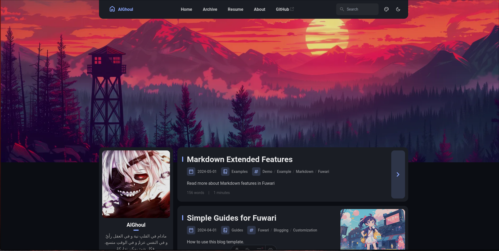

# Blog

A static blog template built with [Astro](https://astro.build) and based on [Fuwari](https://github.com/saicaca/fuwari).

[**🖥️ Live Demo**](https://alghoul.dev)



## Development [Nix]
```bash
# Navgiate to app
cd app/

# Enter dev env [Nix]
nix develop --impure

# Install node_modules
npm install

# Run dev server
npm run dev
```
## ⚙️ Posts Structure

```yaml
---
title: My First Blog Post
published: 2023-09-09
description: This is the first post of my new Astro blog.
image: ./cover.jpg
tags: [Foo, Bar]
category: Front-end
draft: false
lang: jp      # Set only if the post's language differs from the site's language in `config.ts`
---
```
## Technology
- [Astro](https://astro.build/)
- [SvelteKit](https://kit.svelte.dev/)
